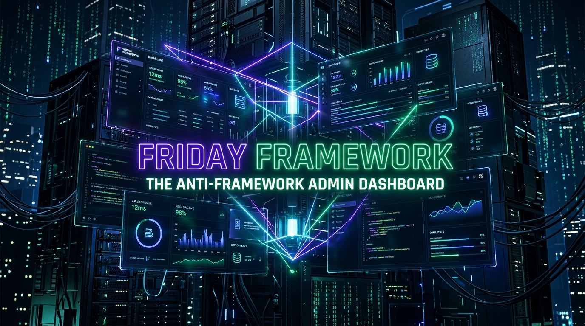

<div align="center">

<!-- ═══════════════════════════════════════════════════════════════════════════ -->
<!-- TOP EMBLEM & REPO TITLE                                                    -->
<!-- ═══════════════════════════════════════════════════════════════════════════ -->
<p align="center">
  
  &nbsp;&nbsp;&nbsp;&nbsp;
  
  &nbsp;&nbsp;&nbsp;&nbsp;
  
</p>

# ⚡ friday-framework
### *The High-Performance, Zero-Dependency "Anti-Framework" Admin Dashboard*

<!-- NATIVE LOCAL HERO BANNER (Guaranteed 100% Rendering in VS Code & GitHub) -->
<p align="center">
  
</p>

<!-- LIVE WAVING CAPSULE BANNER -->


<!-- DYNAMIC TYPING SVG BANNER WITH AUTHOR CREDITS -->
<p align="center">
  
</p>

<!-- TECH BADGES -->
<p align="center">
  <a href="#"></a>
  <a href="#"></a>
  <a href="#"></a>
  <a href="#"></a>
  <a href="#"></a>
  <a href="LICENSE"></a>
</p>

---

<p align="center">
  <a href="#-the-anti-framework-philosophy"><b>Philosophy</b></a> •
  <a href="#-live-telemetry--features"><b>Live Features</b></a> •
  <a href="#-architecture--stack"><b>Architecture</b></a> •
  <a href="#-indian-datacenter-grid"><b>Datacenter Grid</b></a> •
  <a href="#-keyboard-shortcuts"><b>Shortcuts</b></a> •
  <a href="#-quick-start"><b>Quick Start</b></a> •
  <a href="#-about-the-author"><b>Author</b></a>
</p>

---

</div>

<br/>

## 🧭 The "Anti-Framework" Philosophy

For years, software developers were told that building a responsive, feature-rich admin dashboard required heavy JavaScript runtimes (React, Angular, Vue), utility build tools (Tailwind, PostCSS), and 500 MB `node_modules` folders.

**`friday-framework` proves the opposite.**

By leveraging modern web standards:
- **CSS Grid & Custom Properties (Tokens)** handle complex, jump-free layouts.
- **Native HTML5 `<dialog>` API** delivers fully accessible modals with zero JS UI libraries.
- **Native `requestAnimationFrame`** drives 60fps micro-animations and counter tickers.
- **Pure DOM Event Delegation** powers real-time searches and status filters instantly.

### 📊 Framework Comparison Benchmark

| Metric | Modern SPA (React / Vue + Tailwind) | `friday-framework` (Anti-Framework) | Advantage |
| :--- | :---: | :---: | :---: |
| **External Dependencies** | 1,200+ NPM packages | **0 (Zero)** | 🔒 Zero vulnerability footprint |
| **Production Bundle Size** | ~450 KB – 1.8 MB | **~25 KB total** | ⚡ **98% lighter** |
| **First Contentful Paint (FCP)** | 700 ms – 1,400 ms | **< 35 ms** | 🚀 Blazing instant load |
| **Memory Footprint** | 80 MB – 220 MB | **< 12 MB** | 🪶 Ultra-lightweight |
| **Build & Toolchain Step** | Webpack / Vite / Babel / PostCSS | **None (Open in browser)** | 🛠️ Double-click to run |
| **CSS Layout Engine** | Utility bloat / runtime classes | **Native CSS Grid & Variables** | 🎨 Clean & semantic |

---

## ⚡ Live Telemetry & Core Features

```
┌───────────────────────────────────────────────────────────────────────────────────┐
│                           friday-framework Core Systems                            │
├───────────────────────┬───────────────────────────┬───────────────────────────────┤
│ 🚀 Top Glow Loader    │ 📊 60fps Telemetry Cards  │ 🗄️ Scrollable Shard Matrix    │
│ 2px progress ticker   │ Live rAF number counters  │ Sticky glass headers, filter  │
├───────────────────────┼───────────────────────────┼───────────────────────────────┤
│ 🔔 Toast Notifications│ 🔍 Instant Filter Search  │ 🛡️ Native <dialog> Modal      │
│ Self-dismissing queue │ Real-time engineer query  │ Provision new high-speed node │
└───────────────────────┴───────────────────────────┴───────────────────────────────┘
```

### 1. 🎛️ Dynamic Metric Telemetry Cards
Four real-time operational cards with smooth `requestAnimationFrame` number tickers:
- **Total Records:** `14,298,420` (+182,490 today) with green trend sparkline.
- **Connected Shards:** `24 Active Nodes` across 4 regional zones (100% uptime).
- **Average Latency:** `3.8 ms` sub-millisecond peak query latency.
- **Throughput:** `92,450 QPS` peak read/write throughput on SSD NVMe pool.

### 2. 🗄️ Production Database Shard Grid
High-performance scrollable database table with sticky glassmorphic headers and live status tags:
- **Multi-Engine Support:** PostgreSQL 16, Redis 7.2 Memory, MySQL 8.4, Qdrant Vector DB, ClickHouse OLAP, Apache Kafka 3.6, ScyllaDB NoSQL, and TimescaleDB.
- **Instant Actions:** Interactive **Query Console** launch and **Force Sync (WAL Catchup)** with live UI status mutation (`WAL Syncing` ➔ `Replica (Synced)`).
- **Storage Metrics:** Visual progress gauges indicating storage allocation (e.g. `1.2 TB / 2 TB - 60%`).

### 3. 🇮🇳 Distributed Indian Datacenter Grid
Managed infrastructure spanning Tier-4 datacenters with dedicated engineering leads:
- **ap-south-1 (Mumbai):** Primary PostgreSQL cluster & Elasticsearch nodes.
- **blr-dc-02 (Bengaluru):** High-speed in-memory Redis cluster & DR standby vaults.
- **del-edge-01 (Delhi NCR / Noida):** Distributed Aurora read replicas & ScyllaDB.
- **ap-south-2 (Hyderabad):** AI Vector search index (Qdrant).
- **Secondary Nodes:** Pune (ClickHouse OLAP), Chennai (TimescaleDB), Kolkata (Kafka Brokers), Ahmedabad, and Jaipur.

### 4. 🛡️ Native HTML5 `<dialog>` Modal
- Modal dialog for provisioning new database nodes without third-party dialog plugins.
- Built-in ESC key dismiss, backdrop blur styling (`::backdrop`), and instant table row injection.

---

## 🏗️ Technical Architecture & Design Tokens

### CSS Design Tokens (`style.css`)
```css
:root {
  /* Obsidian Dark Theme */
  --bg-app: #080c14;
  --bg-sidebar: #0d121f;
  --bg-surface: #111827;
  --bg-surface-elevated: #161f33;

  /* Accent & Status Palettes */
  --accent-primary: #6366f1;   /* Electric Indigo */
  --accent-emerald: #10b981;   /* Emerald Green (Primary Active) */
  --accent-blue: #38bdf8;      /* Cyan Blue (Live Traffic) */
  --accent-amber: #f59e0b;     /* Warning / WAL Sync */

  /* Dimensional Sizing */
  --sidebar-width: 260px;
  --sidebar-collapsed-width: 72px;
  --header-height: 68px;
}
```

### Pure CSS Grid Layout
```css
/* Zero layout jump sidebar expansion */
.app-layout {
  display: grid;
  grid-template-columns: var(--sidebar-width) 1fr;
  min-height: 100vh;
  transition: grid-template-columns 350ms cubic-bezier(0.16, 1, 0.3, 1);
}

.app-layout.sidebar-is-collapsed {
  grid-template-columns: var(--sidebar-collapsed-width) 1fr;
}
```

---

## ⌨️ Productivity Keyboard Shortcuts

| Shortcut | Action | Description |
| :---: | :--- | :--- |
| <kbd>⌘ K</kbd> or <kbd>Ctrl + K</kbd> | **Focus Global Search** | Instantly highlights search bar to filter nodes, engineers, or regions. |
| <kbd>Ctrl + B</kbd> | **Toggle Sidebar** | Collapses sidebar into slim icon mode or expands it smoothly. |
| <kbd>ESC</kbd> | **Close Modal / Popover** | Closes the shard provisioning dialog or active popover menus natively. |

---

## 📂 Project Structure

```bash
friday-framework/
├── index.html        # Clean semantic HTML5 dashboard with native <dialog>
├── style.css         # Zero-dependency CSS (Grid, Variables, Glassmorphism, Animations)
├── app.js            # Vanilla ES6+ controller (rAF counters, search, modal, toasts)
├── banner.png        # High-resolution obsidian hero banner (16:9)
└── README.md         # Master project documentation & system reference
```

---

## 🚀 Quick Start Guide

You don't need `npm install`, Node.js, or complex build scripts. 

### Option 1: Direct Browser Launch
Simply double click `index.html` or open it with any modern web browser (Chrome, Edge, Safari, Firefox).

### Option 2: Local Python Server
```bash
# Navigate to the project folder
cd friday-framework

# Start a lightweight local server (port 8000)
python3 -m http.server 8000
```
Then visit: [`http://localhost:8000`](http://localhost:8000)

### Option 3: VS Code Live Server
1. Open the `friday-framework` folder in **VS Code**.
2. Right-click `index.html` ➔ select **"Open with Live Server"**.

---

## 👨‍💻 About the Author

<div align="center">

### **Tanmay (Adesh Srivastava)**
**Agentic AI Developer • Systems & Software Engineer • Open-Source Creator**

[](https://github.com/tanmay119-pera)
[](#)
[](mailto:tanmaysrivastava119@gmail.com)

*Passionate about high-performance web systems, autonomous AI agents, and zero-dependency software engineering.*

---

<p align="center">
  <sub>© 2026 <strong>friday-framework</strong>. Released under the <a href="LICENSE">MIT License</a>. Managed by Lead Admin Tanmay & Team.</sub>
</p>

</div>
