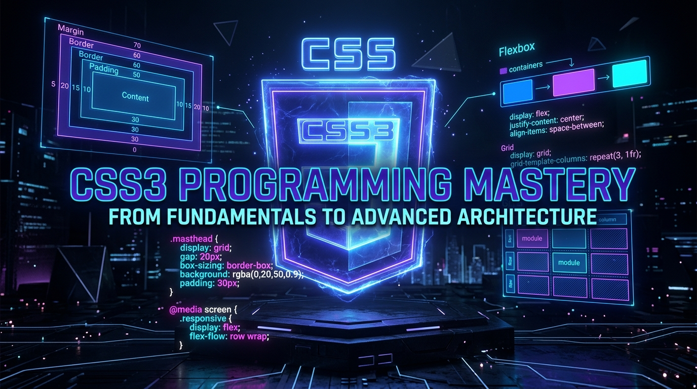
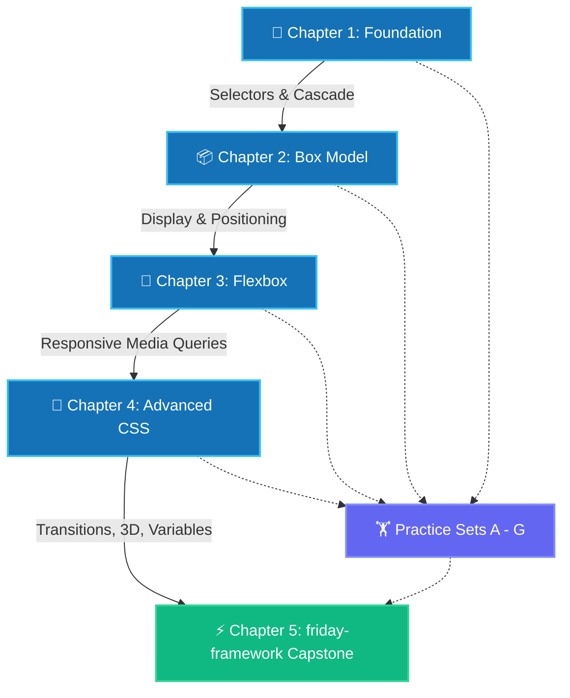

<div align="center">

<!-- ═══════════════════════════════════════════════════════════════════════════ -->
<!-- TOP EMBLEM & REPO TITLE                                                    -->
<!-- ═══════════════════════════════════════════════════════════════════════════ -->

# 🎨 CASCADING STYLE SHEETS (CSS3) MASTERY
### *The Ultimate Engineering Curriculum: From Core Fundamentals to Advanced Systems & Responsive UI Architecture*

<!-- NATIVE LOCAL HERO BANNER (100% Guaranteed Native Rendering in VS Code & GitHub) -->
<p align="center">
  
</p>


<!-- DYNAMIC TYPING SVG BANNER WITH AUTHOR CREDITS -->
<p align="center">
  
</p>

<p align="center">
  
</p>


<!-- TECH BADGES -->
<p align="center">
  <a href="https://developer.mozilla.org/en-US/docs/Web/CSS"></a>
  <a href="https://github.com/tanmay119-pera/HTML-PROGRAMMING.git"></a>
  <a href="https://developer.mozilla.org/en-US/docs/Web/JavaScript"></a>
  <a href="https://code.visualstudio.com/"></a>
  <a href="#"></a>
  <a href="LICENSE"></a>
</p>

---

<p align="center">
  <a href="#-curriculum-navigation-hub"><b>Navigation Hub</b></a> •
  <a href="#-learning-progression-map"><b>Learning Roadmap</b></a> •
  <a href="#-chapter-1-foundation-syntax--selectors"><b>Ch 1: Foundation</b></a> •
  <a href="#-chapter-2-box-model-positioning--units"><b>Ch 2: Box Model</b></a> •
  <a href="#-chapter-3-flexbox--responsive-design"><b>Ch 3: Flexbox</b></a> •
  <a href="#-chapter-4-advanced-css-mastery"><b>Ch 4: Advanced</b></a> •
  <a href="#-chapter-5-production-capstone--friday-framework"><b>Ch 5: Capstone</b></a> •
  <a href="#-practice-sets-a-to-g"><b>Practice Sets</b></a> •
  <a href="#-about-the-author"><b>Author</b></a>
</p>

---

</div>

<br/>

> [!IMPORTANT]
> ### 🛑 Prerequisites & Web Architecture Context
> **HTML** forms the structural skeleton of the web, while **CSS** acts as the skin, presentation layer, and interactive motion engine. 
> If you haven't mastered HTML markup and semantic elements yet, visit the prerequisite foundation repository first:
> 
> 🔗 **Official HTML Repository:** [https://github.com/tanmay119-pera/HTML-PROGRAMMING.git](https://github.com/tanmay119-pera/HTML-PROGRAMMING.git)

<br/>

---

## 🗺️ Curriculum Navigation Hub

| Module / Directory | Level | Status | Core Concepts & Highlights | Link |
| :--- | :---: | :---: | :--- | :---: |
| **`CH-1-INTRO-CSS.CSS`** | Beginner | Complete | Anatomy of CSS, 3 Ways to Apply, Selectors (`tag`, `.class`, `#id`), Colors (HEX, RGB, HSL), Typography, Specificity & Cascade | [Explore Folder](./CH-1-INTRO-CSS.CSS/) |
| **`CH-2-BOX-MODEL-CSS.CSS`** | Beginner to Intermediate | Complete | Box Model (Content, Padding, Border, Margin), `display` modes, `rgba` transparency, Units (`rem`, `em`, `vh`, `vw`), Positioning (`static`, `relative`, `absolute`, `fixed`, `sticky`), `z-index` | [Explore Folder](./CH-2-BOX-MODEL-CSS.CSS/) |
| **`CH-3-FLEXBOX-LAYOUT-CSS.CSS`** | Intermediate | Complete | 1D Flexbox Model, Axes, Container Rules (`justify-content`, `align-items`, `flex-wrap`), Item Rules (`flex-grow`, `flex-shrink`, `flex-basis`), Media Queries & Breakpoints | [Explore Folder](./CH-3-FLEXBOX-LAYOUT-CSS.CSS/) |
| **`CH-4-ADVANCE-CSS`** | Advanced | Complete | CSS Transitions, 2D/3D Transforms, Keyframe Animations, Pseudo-elements (`::before`, `::after`), Custom Properties (Variables), `clip-path`, Filters & 3D Card Flipping | [Explore Folder](./CH-4-ADVANCE-CSS/) |
| **`CH-5-PROJECT`** | Production | Complete | **`friday-framework`**: High-performance zero-dependency Anti-Framework Admin Dashboard with 24 database shards, Indian cloud datacenters & 60fps telemetry | [Explore Folder](./CH-5-PROJECT/) |
| **`PRACTICE-SET.CSS`** | All Levels | Complete | 7 Comprehensive Challenge Sets (A to G): Basics, Typography, Real-World Navbars (Amazon.in), RGBA Layouts, Stacking Battles, Responsive Boxes, Infinite Loaders | [Explore Folder](./PRACTICE-SET.CSS/) |

<br/>

<details>
<summary><b>📂 Expand Complete Repository Directory Tree</b></summary>

```bash
CSS-PROGRAMMING/
├── banner.png                              # High-resolution master CSS banner (16:9)
├── README.md                               # Master curriculum documentation
├── CH-1-INTRO-CSS.CSS/                     # Chapter 1: Foundation & Selectors
│   ├── index.html                          # Semantic demo document
│   └── style.css                           # Syntax, colors, fonts, specificity
├── CH-2-BOX-MODEL-CSS.CSS/                 # Chapter 2: The CSS Box Model & Layout
│   ├── index.html                          # Visual layout boxes
│   └── style.css                           # Box model, positioning, units, z-index
├── CH-3-FLEXBOX-LAYOUT-CSS.CSS/            # Chapter 3: Flexbox & Responsive UI
│   ├── index.html                          # Flexbox playground
│   └── style.css                           # Axes alignment & media queries
├── CH-4-ADVANCE-CSS/                       # Chapter 4: Advanced CSS Mastery
│   ├── index.html                          # Interactive 3D scene & animations
│   └── style.css                           # Transitions, transforms, variables, 3D
├── CH-5-PROJECT/                           # Chapter 5: Capstone Application
│   ├── banner.png                          # Obsidian 3D hero banner
│   ├── index.html                          # Zero-dependency admin dashboard
│   ├── style.css                           # Pure CSS Grid, Tokens, Glassmorphism
│   ├── app.js                              # Vanilla JS telemetry controller
│   └── README.md                           # Friday framework documentation
└── PRACTICE-SET.CSS/                       # Practical Sets (A to G)
    ├── index.html                          # Component challenge playground
    └── style.css                           # Amazon navbar, loader, responsive boxes
```
</details>

---

<br/>

## 📈 Learning Progression Map



---

<br/>

## 🎨 Chapter 1: Foundation, Syntax & Selectors

**Chapter 1** establishes the foundational mechanics of how CSS interacts with the HTML Document Object Model (DOM).

```
       +-----------------------------------+
       |            Web Browser            |
       |                                   |
       |   [ HTML: Structure & Content ]   |
       |                 +                 |
       |   [ CSS: Colors, Fonts, Layout]   |
       |                 =                 |
       |   [ ✨ Beautiful Web Page ✨ ]    |
       +-----------------------------------+
```

### 🧠 Core Concepts Mastered:
- **Anatomy of a CSS Rule:** `selector { property: value; }`
- **3 Ways to Apply CSS:** External (`<link>`), Internal (`<style>`), and Inline (`style="..."`).
- **Core Selectors:** Element (`h1`, `p`), Class (`.btn`), ID (`#main`), Universal (`*`), Grouping (`h1, h2, h3`), and Descendants (`div p`).
- **CSS Color Systems:**
  - **Named Colors:** `red`, `lightblue`, `emerald`.
  - **HEX:** `#FF5733` (Red, Green, Blue channels in 2-digit hexadecimal).
  - **RGB:** `rgb(255, 87, 51)` (Channel intensity $0 - 255$).
  - **HSL:** `hsl(9, 100%, 60%)` (Hue $0^\circ-360^\circ$, Saturation $\%$, Lightness $\%$).
- **Typography:** Font families (`serif`, `sans-serif`, `monospace`), `font-weight`, `line-height`, `text-align`, and `text-transform`.
- **CSS Specificity Hierarchy:**
  $$\text{Inline Styles} (1000) > \text{IDs} (100) > \text{Classes} (10) > \text{Elements} (1)$$

---

<br/>

## 📦 Chapter 2: Box Model, Positioning & Units

In CSS, **every single element on the screen is a rectangular box**. Understanding the Box Model is the turning point from struggling with layouts to completely commanding them.

```
+-------------------------------------------------------------+
|                           MARGIN                            |
|  (Clears an area outside the border. Transparent space)     |
|   +-----------------------------------------------------+   |
|   |                       BORDER                        |   |
|   |  (A visible boundary line around padding & content) |   |
|   |   +---------------------------------------------+   |   |
|   |   |                   PADDING                   |   |   |
|   |   |  (Clears an area around the content. Inner) |   |   |
|   |   |   +-------------------------------------+   |   |   |
|   |   |   |               CONTENT               |   |   |   |
|   |   |   |  (Where your text, images & media   |   |   |   |
|   |   |   |   actually appear. Width x Height)  |   |   |   |
|   |   |   +-------------------------------------+   |   |   |
|   |   +---------------------------------------------+   |   |
|   +-----------------------------------------------------+   |
+-------------------------------------------------------------+
```

### 🧠 Core Concepts Mastered:
- **Box Dimensions:** `width`, `height`, and the TRBL Clockwise Rule (`Top` $\rightarrow$ `Right` $\rightarrow$ `Bottom` $\rightarrow$ `Left`).
- **Display Modes:**
  - `block`: Takes $100\%$ width, starts on a new line.
  - `inline`: Wraps around text, ignores `width` and `height`.
  - `inline-block`: Flows side-by-side like text, but **respects custom width and height**.
  - `none`: Completely removes element and collapses layout space (vs `visibility: hidden` which preserves the blank gap).
- **Relative & Responsive Units:** `px` (absolute), `%` (parent relative), `em` (font relative), `rem` (root HTML relative), `vh` ($1\%$ viewport height), `vw` ($1\%$ viewport width).
- **Positioning Modes:**
  - `static`: Default normal document flow.
  - `relative`: Offset from its own natural position without disturbing siblings.
  - `absolute`: Glued relative to the nearest positioned ancestor (`position != static`).
  - `fixed`: Pinned relative to the browser viewport (stays visible on scroll).
  - `sticky`: Scrolls normally until reaching a screen offset threshold, then locks in place.
- **Stacking Order (`z-index`):** Layering elements on the 3D Z-axis.

---

<br/>

## 🤸 Chapter 3: Flexbox & Responsive Design

Say goodbye to hacky floats and clearing fixes. Flexbox is the **one-dimensional layout model** designed to distribute space and dynamically align items along rows and columns.

```
                MAIN AXIS (when flex-direction: row)
    ========================================================>
    +------------------------------------------------------+
    |  FLEX CONTAINER                                      |
|   |  +----------+  +----------+  +----------+            |
| C |  |  Flex    |  |  Flex    |  |  Flex    |            |
| R |  |  Item 1  |  |  Item 2  |  |  Item 3  |            |
| O |  +----------+  +----------+  +----------+            |
| S |                                                      |
| S |                                                      |
v   |                                                      |
    +------------------------------------------------------+
    CROSS AXIS (Perpendicular to Main Axis)
```

### 🧠 Core Concepts Mastered:
- **Container Properties (Parent):**
  - `flex-direction`: `row`, `row-reverse`, `column`, `column-reverse`.
  - `justify-content`: `flex-start`, `flex-end`, `center`, `space-between`, `space-around`, `space-evenly`.
  - `align-items`: Cross-axis line alignment (`stretch`, `center`, `flex-start`, `flex-end`, `baseline`).
  - `flex-wrap`: Single-line squeezing vs multi-line flow (`nowrap`, `wrap`).
- **Flex Item Properties (Children):**
  - `flex-grow`: Absorbing available free space proportionally.
  - `flex-shrink`: Shrinking dynamically to prevent container overflow.
  - `flex-basis`: Initial default size before remaining space distribution.
  - Shorthand: `flex: 1 1 auto;`
- **Responsive Media Queries:**
  - Breakpoints: Mobile ($\le 600\text{px}$), Tablet ($601\text{px} - 1024\text{px}$), Desktop ($\ge 1025\text{px}$).
  - Adaptive layouts: Switching from horizontal navigation to stacked mobile drawer menus.

---

<br/>

## 🚀 Chapter 4: Advanced CSS Mastery

Transform static web pages into interactive, cinematic, hardware-accelerated user experiences.

```
       [ Initial State ]  ────── (Duration + Timing Function) ──────>  [ Hover / Active State ]
        (e.g., color: red)                                               (e.g., color: blue)
```

### 🧠 Core Concepts Mastered:
- **CSS Transitions:** `transition: background-color 0.4s ease-in-out, transform 0.4s ease;`
- **2D & 3D Transforms:** `rotate()`, `scale()`, `translate()`, `skew()`, and `transform-origin`.
- **CSS Animations & Keyframes:** Automatic and infinite animation timelines using `@keyframes` with `alternate` and `forwards` fill modes.
- **Pseudo-Elements:** `::before` and `::after` for cosmetic design accents, `::first-letter` (drop caps), `::selection`, and `::placeholder`.
- **CSS Custom Properties (Variables):** Defining reusable tokens on `:root` (`--primary-color: #6366f1;`) enabling instant dark/light theme switching.
- **Modern Visual FX:**
  - `clip-path`: Cutting custom geometric masks (circle, polygon, inset, SVG path).
  - `filter`: Photoshop-grade browser effects (`blur()`, `brightness()`, `contrast()`, `drop-shadow()`, `hue-rotate()`).
  - `perspective` & `transform-style: preserve-3d`: True 3D coordinate space and interactive 3D card flipping components.

---

<br/>

## ⚡ Chapter 5: Production Capstone — `friday-framework`

Located in [`CH-5-PROJECT/`](./CH-5-PROJECT/), this capstone is a **production-grade, zero-dependency "Anti-Framework" Admin Dashboard**.

```
┌───────────────────────────────────────────────────────────────────────────────────┐
│                           friday-framework Core Systems                            │
├───────────────────────┬───────────────────────────┬───────────────────────────────┤
│ 🚀 Top Glow Loader    │ 📊 60fps Telemetry Cards  │ 🗄️ Scrollable Shard Matrix    │
│ 2px progress ticker   │ Live rAF number counters  │ Sticky glass headers, filter  │
├───────────────────────┼───────────────────────────┼───────────────────────────────┤
│ 🔔 Toast Notifications│ 🔍 Instant Filter Search  │ 🛡️ Native <dialog> Modal      │
│ Self-dismissing queue │ Real-time engineer query  │ Provision new high-speed node │
└───────────────────────┴───────────────────────────┴───────────────────────────────┘
```

### 🌟 Architectural Highlights:
* **The "Anti-Framework" Difference:** Zero external CSS/JS framework dependencies. No React, Vue, Tailwind, or Bootstrap. Pure modern HTML5 semantic elements + CSS Grid + Vanilla JS.
* **Production Bundle Size:** **~25 KB total** (98% lighter than a standard SPA dashboard).
* **Telemetry & Shards:** 24 connected shards across Tier-4 Indian datacenters (Mumbai, Bengaluru, Delhi NCR, Hyderabad).
* **Multi-Engine Shard Matrix:** PostgreSQL 16, Redis 7.2 Memory, MySQL 8.4, Qdrant Vector DB, ClickHouse OLAP, Apache Kafka 3.6, and ScyllaDB NoSQL.
* **Native HTML5 `<dialog>`:** Zero-dependency accessible shard provisioning modal with custom backdrop blur.
* **Keyboard Shortcuts:** Built-in <kbd>⌘K</kbd> / <kbd>Ctrl+K</kbd> search focus and <kbd>Ctrl+B</kbd> sidebar toggle.

---

<br/>

## 🏋️ Practice Sets (A to G)

Located in [`PRACTICE-SET.CSS/`](./PRACTICE-SET.CSS/), these 7 challenge sets test every level of CSS skill:

| Practice Set | Category | Highlight Challenges |
| :--- | :--- | :--- |
| **Set A** | Basics & Priority | Simple blue box, grouped heading classes, inline vs internal vs external cascade battle |
| **Set B** | Typography & Sizing | Centered capitalized headings, universal font families, nested `div` font scaling |
| **Set C** | Shapes & Real-World Navbars | Pure CSS circles with `border-radius: 50%`, **Amazon.in** header navigation bar replica |
| **Set D** | Page Layouts & Transparency | Full viewport layout with header, search, footer, and `rgba` semi-transparent color cards |
| **Set E** | Positioning & Flexbox | Fixed scrolling badge with `z-index: 999`, evenly spaced flex lists, ultimate `div` centering recipe, and `align-items` vs `align-self` priority showdown |
| **Set F** | Responsive Media Queries | 4-stage adaptive color-changing card ($<300\text{px}$, $300-400\text{px}$, $400-600\text{px}$, $>600\text{px}$) |
| **Set G** | Keyframe Animations | Infinite continuous 360-degree circular spinning loader |

---

<br/>

## 🚀 How to Run & Learn

### 1. Clone the Repository
```bash
git clone https://github.com/tanmay119-pera/CSS-PROGRAMMING.git
cd CSS-PROGRAMMING
```

### 2. Open in Visual Studio Code
```bash
code .
```

### 3. Preview Live in Browser
- Install the **Live Server** extension in VS Code.
- Right-click any chapter's `index.html` (e.g., in `CH-1-INTRO-CSS.CSS` or `CH-5-PROJECT`) and select **"Open with Live Server"**.
- Or simply double-click any `index.html` file to open it directly in Google Chrome, Edge, Safari, or Firefox!

---

<br/>

## 👨‍💻 About the Author

<div align="center">

### **Tanmay (Adesh Srivastava)**
**Agentic AI Developer • Systems & Software Engineer • Open-Source Creator**

[](https://github.com/tanmay119-pera)
[](mailto:tanmay.w119@gmail.com)

*Passionate about modern web standards, autonomous AI systems, and high-performance zero-dependency software.*

---

<p align="center">
  <sub>© 2026 <strong>CSS Programming Mastery</strong>. Released under the <a href="LICENSE">MIT License</a>. Crafted with care by Tanmay (Adesh Srivastava).</sub>
</p>

</div>